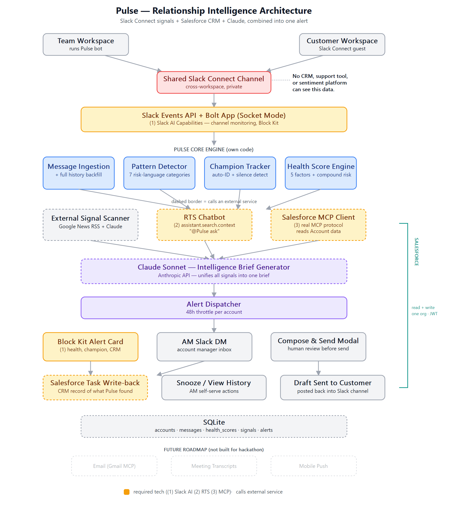

# Pulse

Relationship intelligence for Slack Connect. Pulse watches shared Slack Connect
channels between an account team and their customer, and turns everyday
conversation into an early-warning system for churn risk — surfacing what a
human account manager would otherwise only notice by reading every message
themselves.

Built for the [Slack Agent Builder Challenge](https://slack.com/blog).

## What it does

- **Pattern detection** — scans every message in a shared channel for risk
  signals across 7 categories (contract inquiries, competitor mentions,
  frustration, deprioritization, formality shifts, data exports,
  internal-discussion leaks).
- **Health scoring** — combines message frequency, response latency, risk
  flags, champion silence, and external signals into a 0–100 account health
  score, with compound-risk logic that escalates urgency when multiple severe
  signals line up at once.
- **Champion tracking** — auto-identifies the customer's internal champion
  from conversation patterns and tracks how long they've gone silent.
- **External signal scanning** — a daily job checks news for signals relevant
  to each account (leadership changes, funding, layoffs) and classifies
  relevance with Claude.
- **Salesforce MCP integration** — Pulse acts as a real MCP client, spawning
  Salesforce's official CLI MCP server over stdio to pull live CRM data
  (industry, revenue, headcount) into every brief, and writes back a Task to
  the Salesforce Account whenever it fires an alert — a genuine two-way
  integration, not a one-off lookup.
- **Claude-generated briefs** — when risk crosses a threshold, Claude
  synthesizes conversation history, health trend, champion status, external
  signals, and Salesforce data into a plain-English brief with a suggested
  next action.
- **Human-in-the-loop alerts** — briefs are delivered as Block Kit cards
  DM'd to the account manager, who reviews and edits a suggested outreach
  message in a compose modal before anything is sent — Pulse never messages
  the customer autonomously.
- **RTS chatbot** — `@Pulse ask <question>` answers questions about an
  account using Slack's Real-Time Search (`assistant.search.context`) over
  the account's own message history.

## Architecture



Every account-facing feature (champion tracking, external signals,
Salesforce CRM) is opt-in per account via a toggle, off by default.

## Tech stack

- **Slack Bolt** (Socket Mode) — event ingestion, commands, interactive
  Block Kit actions
- **Anthropic Claude** — brief generation, external signal classification,
  RTS chatbot
- **Salesforce MCP** — official `@salesforce/mcp` CLI server, spoken to via
  the `mcp` Python SDK over stdio; JWT Bearer Flow for headless auth
- **SQLite** — accounts, messages, health scores, signals, alerts
- **APScheduler** — daily external signal scan
- **AWS EC2** (`t3.small`) + **systemd** — always-on hosting for the judging
  window

## Setup

```bash
git clone https://github.com/Stryde123/pulse.git
cd pulse
python -m venv venv
source venv/bin/activate  # or venv\Scripts\activate on Windows
pip install -r requirements.txt
cp .env.example .env      # fill in your own credentials
```

You'll need:

- A Slack app with Socket Mode enabled, `message.channels` and
  `message.groups` event subscriptions (the latter is required for Slack
  Connect / private shared channels), and a bot token with `chat:write`,
  `channels:history`, `groups:history` scopes
- An Anthropic API key
- A Salesforce org with an External Client App configured for JWT Bearer
  Flow (see `salesforce_jwt/` for the certificate setup) — optional, only
  needed if you enable the `enable_salesforce_crm` toggle
- Node.js + npm on the host (Pulse spawns `npx @salesforce/mcp`)

Run it:

```bash
python main.py
```

## Slack commands

All commands are `@Pulse` mentions in a Slack Connect channel — no slash
commands.

| Command | What it does |
|---|---|
| `@Pulse register <#channel> <Account Name> AM:<@user> [value:<n>] [renewal:<YYYY-MM-DD>]` | Register the channel as a monitored account |
| `@Pulse list` | List all registered accounts |
| `@Pulse status <account name or #channel>` | Show current health score and breakdown |
| `@Pulse toggle <account name or #channel> [champion:on/off] [signals:on/off] [crm:on/off]` | Enable/disable opt-in features per account |
| `@Pulse unregister <account name or #channel>` | Stop monitoring and delete all its data |
| `@Pulse ask <question>` | Ask Pulse anything about the account's history, using Slack's Real-Time Search |

## Demo

- **Video:** _coming soon_
- **Live deployment:** hosted on AWS EC2, running continuously for the
  judging period

## Project structure

```
agents/       pattern detection, health scoring, champion tracking,
              external signals, Salesforce MCP client, brief generation
blocks/       Block Kit card builders
db/           SQLite schema and queries
docs/         architecture diagram, thumbnail
salesforce_jwt/  JWT auth certificate (private key gitignored)
scripts/      one-off setup/debug scripts used during development
main.py       Slack Bolt app — event handlers, commands, alert dispatch
```
